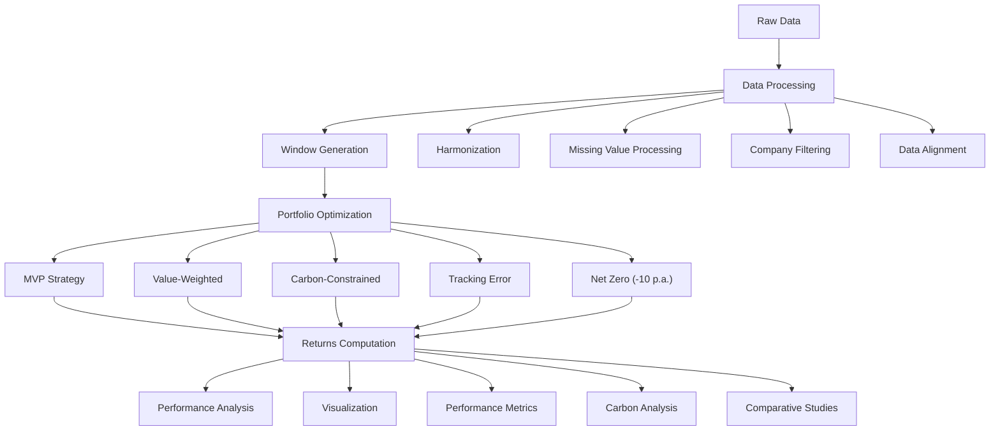

# Sustainability-Aware Asset Management: Asset Allocation with a Carbon Objective

<em>27 mai 2025</em>

---

## Abstract

Can deep portfolio decarbonisation be achieved without eroding financial performance? Using monthly returns and annual CO₂ data for more than 600 North-American equities (2014-2024), we extend mean-variance optimisation into a three-dimensional (μ, σ, carbon) space and evaluate five allocations: (i) an unconstrained minimum-variance portfolio; (ii) a value-weighted benchmark; (iii) a minimum-variance design capped at 50% of its own footprint; (iv) a benchmark-neutral strategy that halves the benchmark footprint subject to a tracking-error budget; and (v) a dynamic Net-Zero portfolio imposing a 10% yearly emissions decline.

Across the sample, carbon-constrained strategies cut financed emissions by 20-50% while delivering Sharpe ratios statistically indistinguishable from—sometimes superior to—the unconstrained benchmark. Their annualised tracking errors cluster around 4.9%, well above the 0.30-0.50% floor to prevent index replication. Only the Net-Zero design at the shortest look-back window (48 months) briefly peaks at 7.4% before reverting below 5% as the estimation horizon lengthens.

Early cuts of up to roughly 50% in carbon footprint appear to entail little to no performance penalty, whereas deeper reductions trade off transparently against the tracking-error "budget". The Net-Zero trajectory remains consistent with a 1.5°C carbon budget while preserving almost the entire equity risk premium, offering counter-evidence to the notion of an inevitable sustainability tax. Overall, the evidence shows that ambitious, Paris-aligned decarbonisation can be embedded in mainstream portfolios through explicit tracking-error limits, offering investors a coherent and auditable framework for aligning assets with the Paris Agreement while maintaining competitive performance.

---

## Keywords

Portfolio Optimization • Carbon Constraints • Climate Finance • Tracking Error • Minimum-Variance Portfolio • Net-Zero Trajectories • Three-Dimensional Trade-Off • Sustainable Investing • Paris Alignment

---

### Authors

Abdul Kadir Jeylani Bakari • Arnaud Küffer • Jules Curti • Tenzin-Minu Zimmer • Yannick Travasa

*HEC Lausanne, Université de Lausanne*

---

## Code Overview

